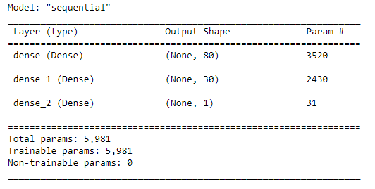
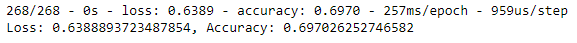

# Neural_Network_Charity_Analysis
## Overview
Use a deep learning neural network to classify potential loan appplicants
## Analysis
#### Data Preprocessing
- The model looked at a csv, `charity_data.csv`, with the ultimate target column `IS_SUCCESSFUL`
- The features of the model are: `APPLICATION_TYPE`, `AFFILIATION`, `CLASSIFICATION`, `USE_CASE`, `ORGANIZATION`, `STATUS`, `INCOME_AMT`, `SPECIAL_CONSIDERATIONS`, and `ASK_AMT`
- The other columns that aren't features or targets are the `EIN` and `NAME` columns, as they are simply individual identifiers
#### Compiling, Training, and Evaluating the Model
- Initially I chose 80 neurons for the starting layer and 30 neurons for the hidden layer. A good rule of thumb is to use 2 to 3 times the number of activation neurons as the number of input features, and since there were 43 input features, I aired on the conservative side so I wouldn't overload my computer with too many neurons. As with the hidden layer, I started with one and only used 30 neurons as it's good practice to lower the number of neurons in each layer. I chose the ReLU activation function because it's a good starting point. Here is the shape of my neural network:

- This model acheived about 70% accuracy with over 60%(!) loss:

Obviously this model needed some tuning. As an initial pass, the model is fine, though the high loss is concerning. 

#### Optimizing and Using Different Models
After looking through the data, I identified two potentially noisy columns: `ASK_AMT` and `STATUS`. `STATUS` because very few applications had the status of 0 and `ASK_AMT` because the values covered a large scale. 
- As an aside, I wasn't entirely sure what I was looking for in potentially 'noisy' columns, so I chose two columns that affected the data in opposite ways and looked at how they affected the models.

To optimize the neural network, I used keras_tuner, that way I could examine many different combinations of activation functions, neurons, and hidden layers to see what worked best. Ultimately, none of the models performed significantly better than the initial model, with the best model having something like a 72% accuracy and 60% loss. The best model is saved as `optimized_application.h5`.

I also wanted to see if other types of machine learning models would perform any better. I tried a balanced random forest classifier and an easy ensemble classifier. Both of those models performed almost exactly as well as the neural network, though the BRFC had the bonus of showing the importance of each column.
## Results
The deep learning model failed to produce an accuracy that would make it a useful tool for predicting future applicants. In addition to failing to reach 75% accuracy in any model, they also all had significant loss of over 50%. This tells me that there are other factors not given in the initial csv that correlate with whether a loan is successful or not.

I also wonder if trying to tackle the data a different way, like using PCA's to lower the dimensionality or even grouping the data in different ways might yield different results. Since it doesn't appear that this neural network strategy is yielding good enough results, it might be fruitful to look at earlier steps in the data processing process.
